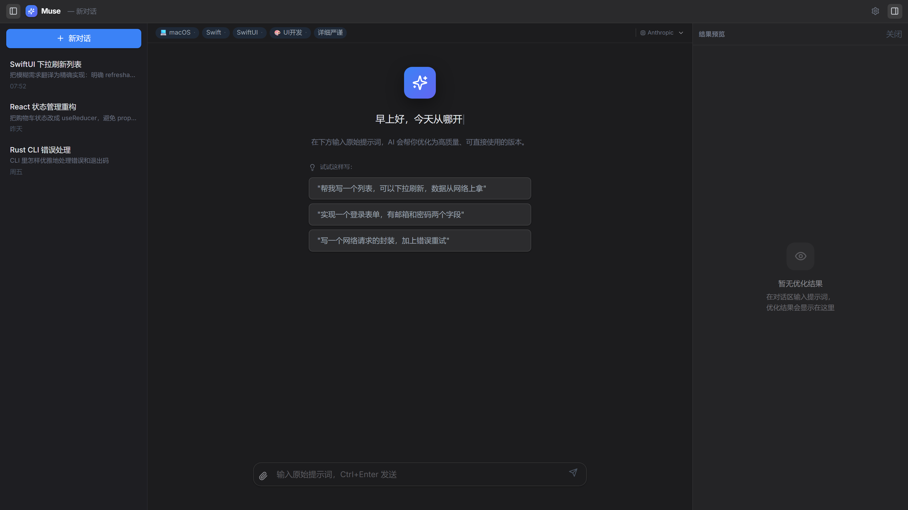
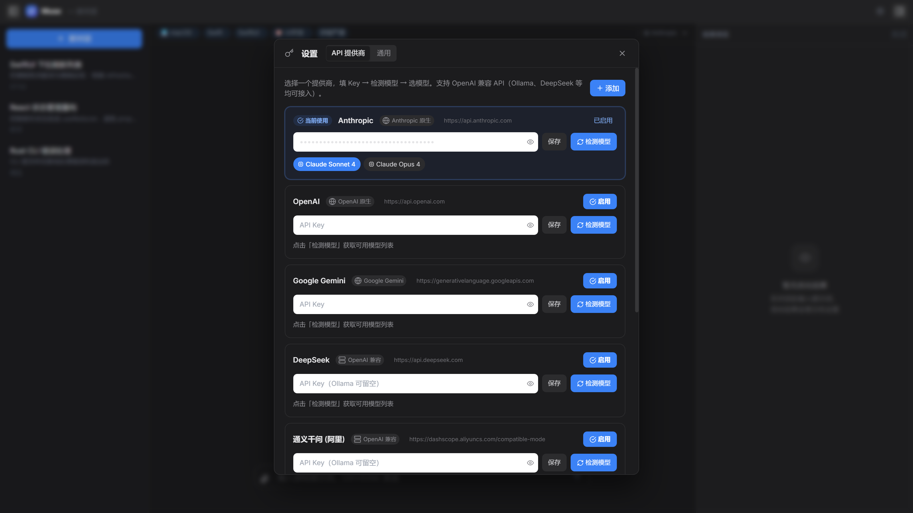

<div align="center">

# 🪶 PromptCraft — Muse 提示词优化助手

**macOS 风格毛玻璃三栏 UI · 多提供商 AI 驱动 · 行级 Diff 可视化**

> 左边选环境，中间聊需求，右边看结果。
> 你不会的技术名词交给 AI，你只管说你要什么。

[](LICENSE)
[](https://www.typescriptlang.org/)
[](https://react.dev/)
[](https://vitejs.dev/)

</div>

---

## 📖 项目简介

PromptCraft（产品代号 **Muse**）是一个 **提示词（Prompt）优化工作台**：输入一句粗糙的原始需求，AI 补全上下文、翻译模糊为精确、补充遗漏的边界条件，输出一份可以直接交付给任何 AI 编程工具的优化提示词——并实时展示原始版本与优化版本的行级 Diff 对比。

它不是又一个聊天套壳，而是围绕 **"提示词工程"** 这个单一目标设计的专用工具：环境上下文（平台/语言/框架/任务/风格）驱动 AI 生成，版本滑块回溯每一次优化迭代，支持多轮对话打磨，支持一键复制交付。

**适配 AI 编程时代的工作流**：如果你用 Quill、Cursor、Copilot 等 AI 编程工具，PromptCraft 负责把你"说不清楚的需求"打磨成它们"能直接执行"的精确指令。

---

## ✨ 功能特性

| 特性 | 说明 |
|------|------|
| 🎨 **macOS 风格毛玻璃 UI** | 三栏可折叠布局，原生观感，浅色/深色/跟随系统三主题 |
| 🧭 **级联环境上下文** | 平台 → 语言 → 框架 逐级联动推荐，带最近使用记忆 |
| 🔌 **多提供商支持** | Anthropic / OpenAI / Gemini / DeepSeek / 通义千问 / Moonshot / 智谱 / SiliconFlow / 任意 OpenAI 兼容 API（Ollama、vLLM 等） |
| ⚡ **流式输出** | SSE 流式渲染，思考过程（reasoning/thinking）实时可见，支持 DeepSeek R1 类推理模型 |
| 📊 **行级 Diff 对比** | 自研 LCS 算法，绿增红删，原始 vs 优化一目了然 |
| 🕰️ **版本回溯** | 每一次优化都是一版，滑块在历史版本间任意切换 |
| 💬 **多轮打磨** | 不满意就继续聊："加上分页" "/简化" —— AI 基于上一版迭代优化 |
| ⌨️ **快捷指令** | `/简化` `/详细` `/举例` `/测试` `/还原` `/新对话` |
| 💾 **本地持久化** | 对话、收藏、预设全部存 localStorage，无后端、无账号、无遥测 |
| 📤 **一键导出** | 对话导出 Markdown / TXT / JSON 格式 |

---

## 🖼️ 界面预览

**主界面** —— 三栏毛玻璃布局：左侧环境上下文与历史对话，中间对话流，右侧原始 vs 优化的行级 Diff 对比：



**设置** —— 多提供商 API 配置，内置 8 家模板 + 任意 OpenAI 兼容端点，一键检测模型：



---

## 🧱 技术栈

| 层 | 技术 | 用途 |
|----|------|------|
| 框架 | **React 18** + **TypeScript 5.5** | UI 与类型安全 |
| 构建 | **Vite 5** | 开发服务器 / 生产构建（esbuild minify，产物 ~223 kB） |
| 状态 | **Zustand** | 轻量全局状态（配置/对话/提供商/版本） |
| 样式 | **Tailwind CSS 3** + 毛玻璃 (`backdrop-blur`) | macOS 风格视觉 |
| 图标 | **lucide-react** | 矢量图标 |
| 持久化 | **localStorage** | 对话 / 提供商 / 收藏 / 设置（无后端） |

> 无任何运行时服务端依赖——纯静态 Web 应用，可部署到任意静态托管（GitHub Pages、Vercel、Netlify）或本地双击运行。

---

## 🚀 快速开始

### 环境要求

- Node.js **18+**（推荐 20 LTS）
- npm 9+

### 安装与运行

```bash
# 克隆并进入项目
git clone https://github.com/<your-username>/PromptCraft.git
cd PromptCraft

# 安装依赖
npm install

# 启动开发服务器（自动打开 http://localhost:1420）
npm run dev
```

Windows 用户也可以直接双击根目录的 **`start.bat`**（自动安装依赖 + 启动 + 打开浏览器）。

### 生产构建

```bash
npm run build     # tsc 类型检查 + vite 打包，输出到 dist/
npm run preview   # 本地预览生产构建
```

---

## ⚙️ 配置 API 提供商

1. 点击左下角 **齿轮图标** → 进入「API 提供商」页
2. 选择一个提供商（Anthropic / Gemini / DeepSeek / 智谱 / Moonshot / SiliconFlow / 通义千问 等已内置模板）
3. 填入 API Key → 点击 **「检测模型」**（自动拉取可用模型列表，Anthropic 为内置已知列表 + Key 有效性校验）
4. 选中模型 → 点击 **「启用」**

**自定义提供商**：任何 OpenAI 兼容 API 均可接入（Ollama、vLLM、LocalAI、代理网关……）——点击「添加」，填名称与端点地址即可，支持模型自动检测。

> **隐私说明**：所有 API Key 仅保存在你浏览器本地的 `localStorage` 中（`pc_providers`），**不经过任何服务器、不上传、无遥测**。代码中不存在任何硬编码密钥。

---

## 🎮 使用指南

### 核心工作流

```
选择环境上下文 → 输入粗糙提示词 → Ctrl+Enter 发送
    → AI 返回优化版 + 右侧 Diff 对比 → 继续对话打磨 → 一键复制交付
```

### 快捷指令

输入 `/` 弹出快捷指令菜单：

| 指令 | 效果 |
|------|------|
| `/简化` | 让提示词更简洁 |
| `/详细` | 展开更多细节 |
| `/举例` | 加入代码示例 |
| `/测试` | 补充测试约束 |
| `/还原` | 回到上一版本 |
| `/新对话` | 新建对话 |

### 快捷键

| 快捷键 | 功能 |
|--------|------|
| `Ctrl+Enter` | 发送消息 |
| `Ctrl+N` | 新建对话 |
| `Ctrl+Shift+C` | 复制优化后的提示词 |
| `/` | 快捷指令菜单 |
| `Esc` | 关闭弹窗 |

---

## 🏗️ 架构设计

```
┌────────────────────────────────────────────────────────┐
│                      浏览器（纯前端）                     │
│  ┌─────────┐   ┌──────────┐   ┌──────────────────┐    │
│  │ 三栏布局 │   │ Zustand  │   │  localStorage     │    │
│  │ 组件层   │──▶│  Store   │──▶│  对话/Key/收藏/设置 │    │
│  └─────────┘   └────┬─────┘   └──────────────────┘    │
│                     │                                  │
│              ┌──────▼──────┐                           │
│              │ services 层 │                           │
│              │ ai / diff / │                           │
│              │ storage /   │                           │
│              │ providers / │                           │
│              │ reports     │                           │
│              └──────┬──────┘                           │
│                     │ fetch / SSE                      │
└─────────────────────┼──────────────────────────────────┘
                      │
        ┌─────────────┴──────────────┐
        │  dev: Vite /api/proxy 中间件 │  ← 解决国内提供商 CORS 限制
        │  prod: 浏览器直连            │  ← Anthropic/Gemini 支持 CORS
        └─────────────┬──────────────┘
                      ▼
        ┌────────────────────────────────┐
        │  Anthropic · OpenAI · Gemini   │
        │  DeepSeek · 智谱 · Moonshot …  │
        └────────────────────────────────┘
```

### 关键技术要点

**1. 统一 AI 抽象层**（`src/services/ai.ts`）

三种协议（Anthropic Messages / OpenAI Chat Completions / Gemini GenerateContent）抽象为同一接口，非流式与 SSE 流式双路径实现：

```ts
export async function callAIStream(
  provider, userInput, config, history, lastOptimized, callbacks, systemPrompt?
): Promise<string>
```

- `onToken` / `onThinking` 分离流式回调——正文与推理过程（`thinking_delta` / `reasoning_content` / `thought`）独立渲染
- 自动解析各家流式协议（SSE `data:` 行、`[DONE]` 哨兵、`content_block_delta` 等）

**2. 行级 LCS Diff 引擎**（`src/services/diff.ts`，65 行）

自研动态规划 LCS（最长公共子序列）实现：O(n·m) 时间/空间，输出带行号与变更类型的 `DiffLine[]`，驱动右侧「原始 vs 优化」的高亮对比与版本滑块。

**3. CORS 开发代理**（`vite.config.ts`）

国内提供商（DeepSeek、智谱等）不支持浏览器跨域，Vite 中间件将 `/api/proxy?target=...` 请求转发到真实端点并透传 `authorization` / `x-api-key` 头；生产构建对支持 CORS 的 Anthropic/Gemini 直连。

**4. 级联上下文模型**（`src/types/index.ts`）

`平台 → 语言 → 框架 → 任务类型 → 风格偏好` 五维上下文，内置跨端级联推荐表（如 macOS→Swift→SwiftUI），并作为结构化变量注入系统提示词。

**5. 系统提示词工程**（`src/services/ai.ts` `buildSystem()`）

Muse 人格：以希腊神话缪斯女神为原型，围绕「补全上下文 / 翻译模糊为精确 / 补充遗漏 / 尊重意图」四原则，输出格式严格约束为「两句摘要 + `---` 分隔 + 可直接执行的完整提示词」，并被 `parseResponse()` 确定性解析。

---

## 📁 项目结构

```
PromptCraft/
├── index.html                   # 入口
├── start.bat                    # Windows 一键启动脚本
├── vite.config.ts               # Vite 配置 + CORS 开发代理插件
├── tailwind.config.js
├── tsconfig.json
└── src/
    ├── App.tsx                  # 主布局（三栏可折叠）
    ├── main.tsx                 # 入口挂载
    ├── store.ts                 # Zustand 全局状态（对话/提供商/版本/预设）
    ├── index.css                # 全局样式 + Tailwind
    ├── types/index.ts           # 类型定义 + 级联数据 + 内置提供商模板
    ├── services/
    │   ├── ai.ts                # 统一 AI 调用（流式 + 非流式，多协议）
    │   ├── providers.ts         # 提供商模型自动检测
    │   ├── storage.ts           # localStorage 持久化 + 导出
    │   ├── reports.ts           # 工作报告摘要
    │   └── diff.ts              # LCS 行级文本对比引擎
    └── components/
        ├── Sidebar/             # 左侧：环境上下文 + 历史对话
        ├── Chat/                # 中间：对话流 + 消息气泡 + 输入栏
        ├── Preview/             # 右侧：Diff 对比 + 版本滑块 + 收藏
        └── Settings/            # 设置弹窗（API 提供商管理）
```

---

## 🔒 隐私与安全

- **零后端**：无服务器、无账号、无统计埋点
- **Key 本地化**：API Key 仅存于浏览器 `localStorage`，代码无任何硬编码密钥（可用 `git grep -E "sk-[A-Za-z0-9]{10,}"` 验证）
- **数据本地化**：对话、收藏、预设全部存本地，可随时一键导出
- 生产环境直连 API 提供商（HTTPS），开发环境经本地 Vite 代理转发

---

## 🗺️ Roadmap

- [ ] 提示词模板库（内置分类模板）
- [ ] 导出完整提示词工作簿（Word/PDF）
- [ ] 多轮优化成本统计（Token 用量）
- [ ] 离线模式（本地模型 via Ollama 已支持，后续优化 UX）
- [ ] i18n（英文界面）

---

## 🤝 参与贡献

欢迎 Issue 与 PR：

1. Fork 本仓库
2. 新建特性分支（`git checkout -b feature/xxx`）
3. 提交改动（`git commit -am 'feat: xxx'`）
4. 推送并创建 Pull Request

开发自检：`npm run build`（tsc 类型检查 + 打包）必须通过。

---

## 📄 License

[MIT](LICENSE) © 2026 PromptCraft Contributors

---

*灵感，是把矿石炼成金子的那道闪电。*
